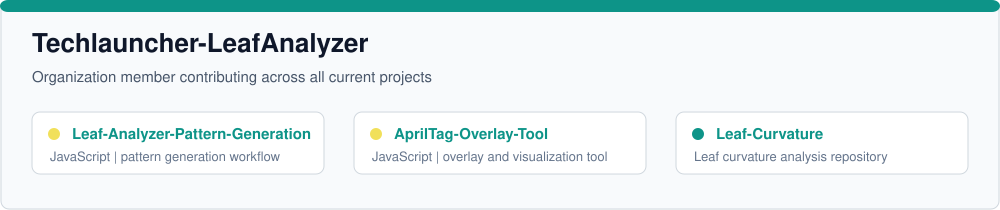
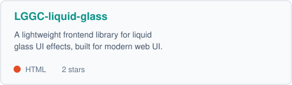
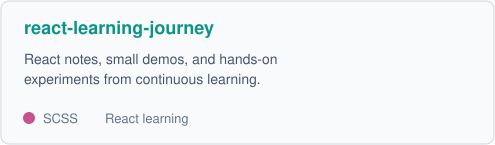
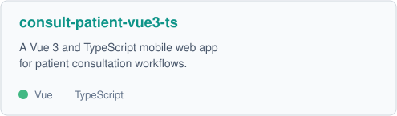
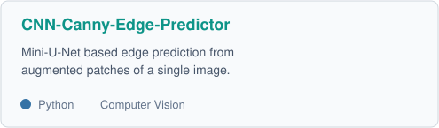
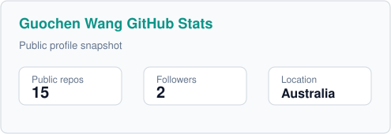
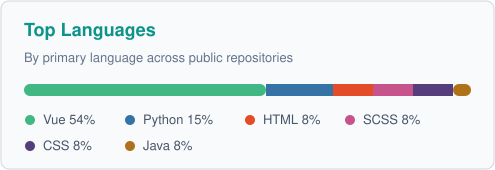

  

  

    
    
    
    
  

  

    
    
  

---

### About Me

I'm **Guochen Wang** (`u7663394`), a developer based in **Australia** focused on building practical front-end products, clean interaction patterns, and useful AI-assisted experiments.

- **Frontend Engineering:** Building Vue, React, and TypeScript applications for admin systems, mobile web apps, and product dashboards.
- **UI Craft:** Exploring modern visual effects, responsive layouts, data visualization, and polished component behavior.
- **Techlauncher-LeafAnalyzer:** Member of [**Techlauncher-LeafAnalyzer**](https://github.com/Techlauncher-LeafAnalyzer), contributing across all current organization projects.
- **Learning in Public:** Keeping notes, demos, and experiments visible through small repositories and hands-on projects.
- **Applied AI:** Experimenting with computer vision, contrastive learning, and financial trend analysis using Python-based workflows.

---

### Currently Focusing On

- **Working with:** [**Techlauncher-LeafAnalyzer**](https://github.com/Techlauncher-LeafAnalyzer) - contributing to the organization's leaf analysis tools and supporting repositories.
- **Working on:** [**LGGC-liquid-glass**](https://github.com/u7663394/LGGC-liquid-glass) - a lightweight frontend library for liquid glass UI effects.
- **Building:** [**react-learning-journey**](https://github.com/u7663394/react-learning-journey) - notes, demos, and experiments from my React learning process.
- **Exploring:** Vue 3 + TypeScript application patterns through admin, management, and mobile consultation projects.
- **Learning:** Applied machine learning and computer vision through SimCLR and CNN edge prediction experiments.

---

### Techlauncher-LeafAnalyzer

I am a member of [**Techlauncher-LeafAnalyzer**](https://github.com/Techlauncher-LeafAnalyzer) and participate in the development of all current projects in the organization:

  

- [**Leaf-Analyzer-Pattern-Generation**](https://github.com/Techlauncher-LeafAnalyzer/Leaf-Analyzer-Pattern-Generation) - JavaScript project for pattern generation in the leaf analysis workflow.
- [**AprilTag-Overlay-Tool**](https://github.com/Techlauncher-LeafAnalyzer/AprilTag-Overlay-Tool) - JavaScript tool for overlaying AprilTag-related outputs.
- [**Leaf-Curvature**](https://github.com/Techlauncher-LeafAnalyzer/Leaf-Curvature) - repository for leaf curvature analysis work.

---

### Featured Projects

Here are a few projects that represent what I am currently building and learning:

  
  

  
  

---

### Tech Stack

<table>
  <tr>
    <td width="50%" valign="top">
      <strong>Frontend Development</strong> 
      
    </td>
    <td width="50%" valign="top">
      <strong>Application Tooling</strong> 
      
    </td>
  </tr>
  <tr>
    <td width="50%" valign="top">
      <strong>AI, Data, and Experiments</strong> 
      
    </td>
    <td width="50%" valign="top">
      <strong>Tools and Workflow</strong> 
      
    </td>
  </tr>
</table>

---

### GitHub Statistics

  
  

